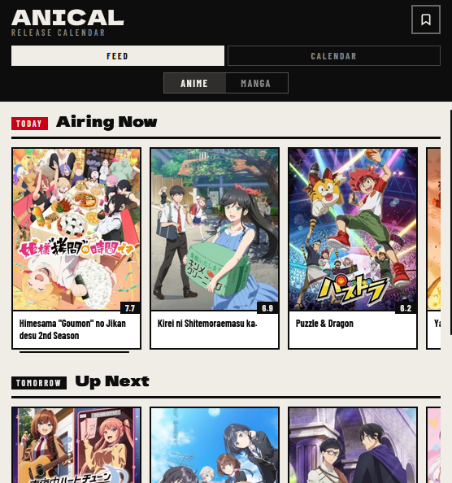

# AniCal

A simple Chrome extension to track anime and manga releases.

## Features

- Feed view for today's, tomorrow's, and current season releases
- Calendar view with day-by-day release browsing
- Bookmark your favorite shows
- Quick info modal with description and score

**Note**: This extension has been submitted to the Firefox Add-ons Store and the Chrome Web Store and is currently awaiting review. Once approved, you'll be able to install it directly from the store without needing to sideload.

## Run Locally

1. Open Chrome and go to `chrome://extensions`
2. Enable **Developer mode**
3. Click **Load unpacked**
4. Select this project folder (`AniCal`)

## Notes

- Data is fetched from `https://api.jikan.moe/v4`
- Bookmarks are saved with `chrome.storage.sync`
